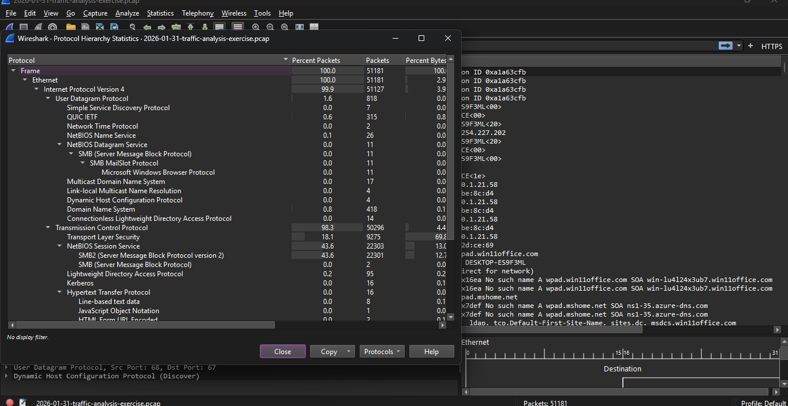
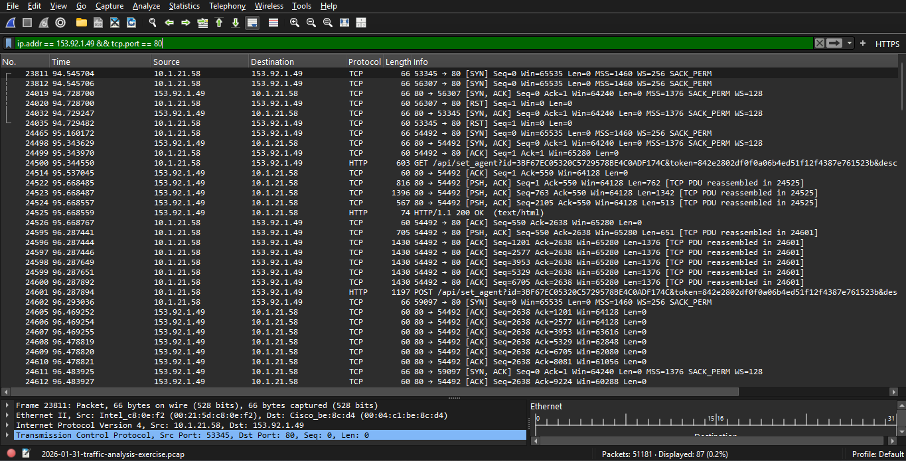
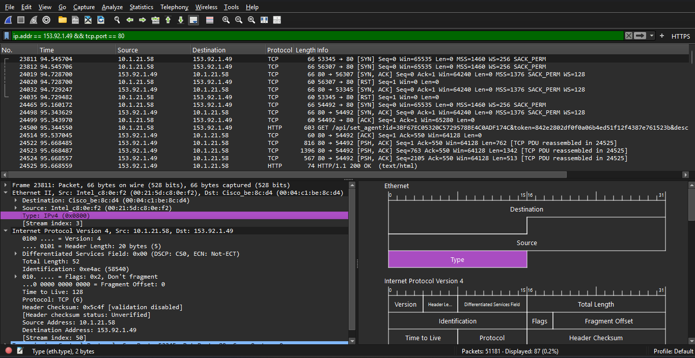
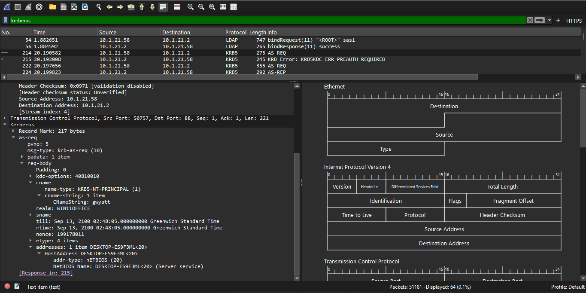
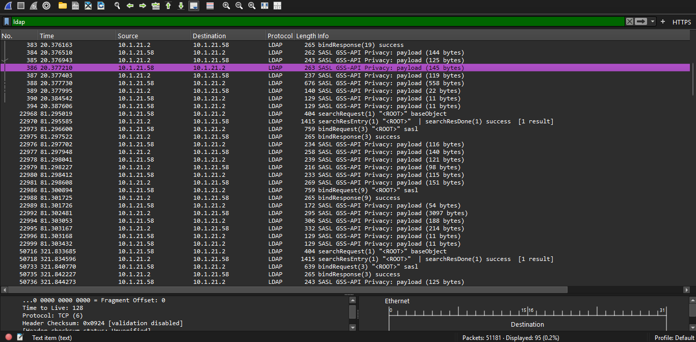
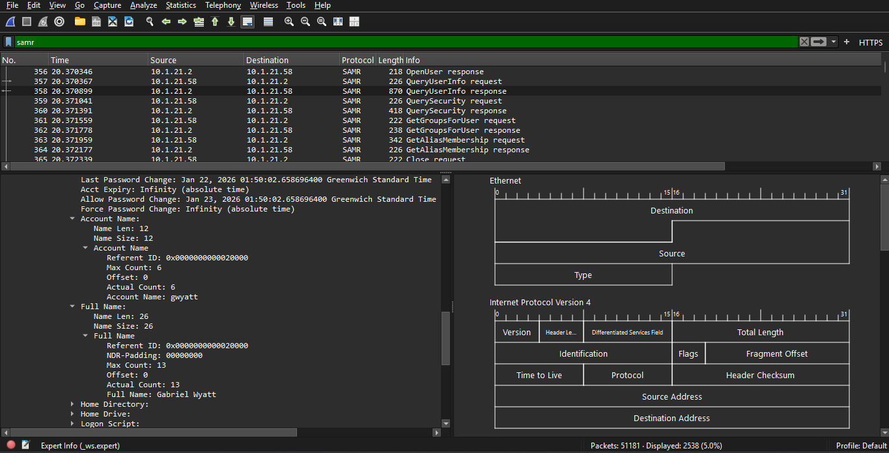
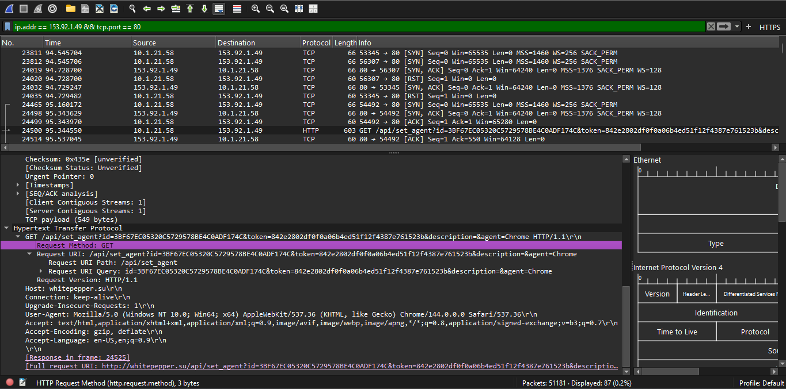

Lumma Stealer Traffic Analysis

Investigation Methodology
Before filtering, I reviewed the capture at a high level to understand what protocols were present, then worked outward from the single IP address provided by the alert to identify the affected host, the associated user, and the malicious domain. The approach followed four stages: orient, identify the host, identify the user, and extract indicators of compromise.

Step 1: Orienting to the Capture
I reviewed Statistics > Protocol Hierarchy with no filter applied to see what protocols were present in the capture before filtering on anything specific. This showed NetBIOS/SMB2, LDAP, Kerberos, DHCP, and DNS traffic in addition to the HTTP and TLS traffic expected from the alert itself, which indicated that host and user identity information would likely be recoverable through Active Directory authentication protocols.

Step 2: Isolating the Alert Traffic
The original alert specified traffic from `153.92.1.49` over TCP port 80. An initial filter on the IP address alone returned both TLS traffic on port 443 and HTTP traffic on port 80 to the same address, so I narrowed the filter to match the alert exactly.

Filter used: `ip.addr == 153.92.1.49 && tcp.port == 80`

This isolated the HTTP traffic matching the alert description and confirmed the internal host communicating with the flagged IP address.

Note: The unrelated TLS/443 session to the same IP included a Client Hello with an SNI value of `whitepepper.su`, which independently corroborates the domain identified later in Step 7, though it is not the traffic the alert referenced.

Step 3: Identifying the Host
From a packet within the isolated alert traffic, I expanded the Internet Protocol Version 4 and Ethernet II layers to obtain the source IP and MAC address of the internal host, confirming first that the IP layer showed `10.1.21.58` as the source so the Ethernet Source field could be correctly attributed to the client.

Infected IP address: `10.1.21.58`
MAC address: `00:21:5d:c8:0e:f2`

Correction: An earlier pass through the capture recorded the MAC address as `14:b3:1f:2d:ce:69`, taken from a packet exchanged between the client and the domain controller. That packet was traveling from the domain controller to the client, so the Ethernet Source field in it belonged to the domain controller, not the infected host. This was corrected by confirming the IP layer's Source field before reading the Ethernet Source field, using a packet where the client was verified as the originator.

Step 4: Identifying the User Account and Host Name
I checked Kerberos traffic first rather than LDAP or SAMR, because Kerberos authentication occurs automatically as part of normal Windows domain login activity, making it the protocol most likely to be present in any given capture. LDAP and SAMR queries, by contrast, only occur when something specifically queries account information, so they are less reliable as a first check.

Filter used: `kerberos`

Within the results, I located an `AS-REQ` (Authentication Service Request) packet, which represents the initial authentication request and carries the requesting user's identity. I confirmed the IP layer showed `10.1.21.58` as the source, then expanded `req-body > cname > cname-string` to obtain the account name, and found the associated host name in the same packet's `addresses` field.

Note: I initially searched for `AS-REQ` in the Protocol column and could not locate it. The Protocol column displays the general protocol name (`KRB5`) for all Kerberos packets; the specific message type is shown in the Info column instead.

Username: `gwyatt`
Host name: `DESKTOP-ES9F3ML`

Step 5: Attempting to Identify the Full Name via LDAP
Filter used: `ldap`

I located `searchResEntry` packets, but the Info column for this traffic consistently showed `SASL GSS-API Privacy: payload`, indicating the LDAP traffic was sealed via Kerberos GSSAPI encryption and could not be read in plaintext. The two unsealed `searchResEntry` packets present in the capture returned only rootDSE metadata (`"<ROOT>"`), not a user record. This ruled out LDAP as a usable source for this capture.

Step 6: Identifying the Full Name via SAMR
Filter used: `samr`

Following the SAMR request sequence (`OpenUser`, `QueryUserInfo`), I located the `QueryUserInfo response` packet, identifiable by its larger size relative to the surrounding request/response packets. I confirmed the IP layer showed the domain controller (`10.1.21.2`) as the source and the client (`10.1.21.58`) as the destination, consistent with this being a response to the client's query. Expanding this packet returned the account name and full name together in the same structure.

Account name: `gwyatt`
Full name: `Gabriel Wyatt`

Note: The `QueryUserInfo response` structure also includes password hash fields (such as `Lm Owf Password`) later in the same packet. These fields were not examined as part of this investigation and are excluded from the screenshot used as evidence.

Step 7: Identifying the Malicious Domain
Filter used: `ip.addr == 153.92.1.49 && tcp.port == 80`

Expanding the HTTP request layer of the `GET` packet from this filter showed the Host header, identifying the domain associated with the flagged IP address. The request URI also showed a `/api/set_agent?id=<token>&description=&agent=Chrome` pattern.

Malicious domain: `whitepepper.su`

Inference: This URI pattern is consistent with the fingerprinting/check-in behavior named in the original alert signature (`ET MALWARE Lumma Stealer Victim Fingerprinting Activity`). This is a reasonable association based on the alert name and URI structure, not something independently confirmed by decoding the request payload itself.

Findings Summary

Infected client IP: `10.1.21.58`
Infected client MAC address: `00:21:5d:c8:0e:f2`
Host name: `DESKTOP-ES9F3ML`
User account name: `gwyatt`
Full name: `Gabriel Wyatt`
Malicious domain: `whitepepper.su`

Indicators of Compromise

Malicious IP: `153.92.1.49`
Malicious domain: `whitepepper.su`
Suspicious URI pattern: `/api/set_agent?id=<token>`

Recommendations
* Isolate the host DESKTOP-ES9F3ML (`10.1.21.58`) from the network pending further investigation.
* Reset credentials for the user account `gwyatt` (Gabriel Wyatt).
* Block the identified IP address and domain at the network perimeter.
* Review other hosts on the LAN segment for the same URI pattern to determine whether the activity is isolated to this host.

Lessons Learned
An Ethernet frame's Source and Destination fields describe the sender and receiver of that specific frame, not a fixed identity for either host. Reading a MAC address from the wrong direction of traffic can misattribute it to the wrong device, as happened during an earlier pass through this capture. Confirming the IP layer's Source/Destination fields before trusting the Ethernet layer prevents this.

Alert details such as protocol and port number should be matched exactly when filtering, rather than filtering on IP address alone. An unrelated TLS session on a different port to the same IP address was present in this capture and could have been mistaken for the alert traffic if the port had not been specified.

LDAP is not a reliable source for account information when traffic is sealed under Kerberos GSSAPI encryption; this can only be confirmed by checking the Info column for SASL privacy indicators rather than assuming the protocol will be readable. SAMR served as an effective alternative source for account details in this case.

Distinguishing between Kerberos message types (such as `AS-REQ`) requires checking the Info column rather than the Protocol column, which only shows the general protocol name.

Packet structures returned by protocols such as SAMR can include sensitive fields (for example, password hash material) that are not relevant to the investigative question being asked. These should be identified and excluded from any screenshots or evidence shared outside the investigation.
